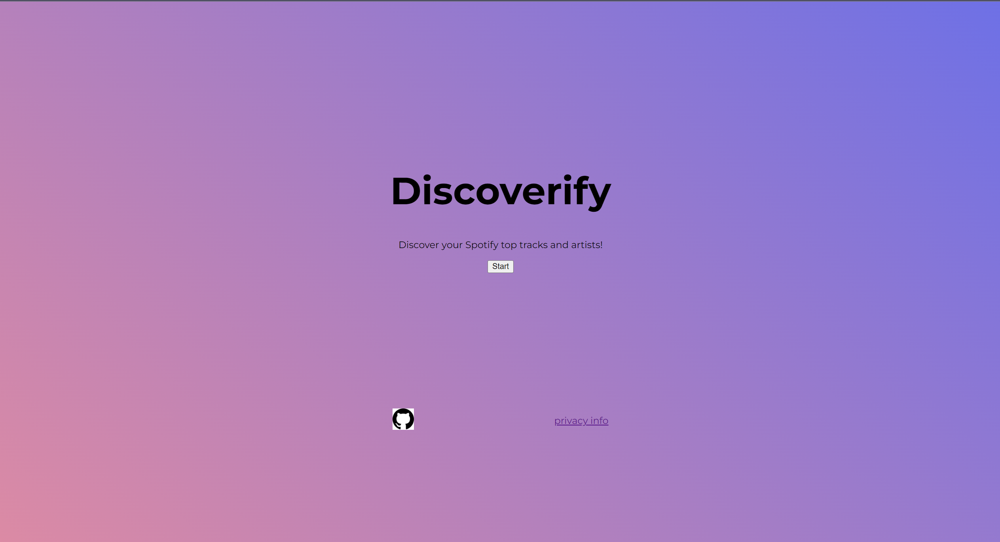
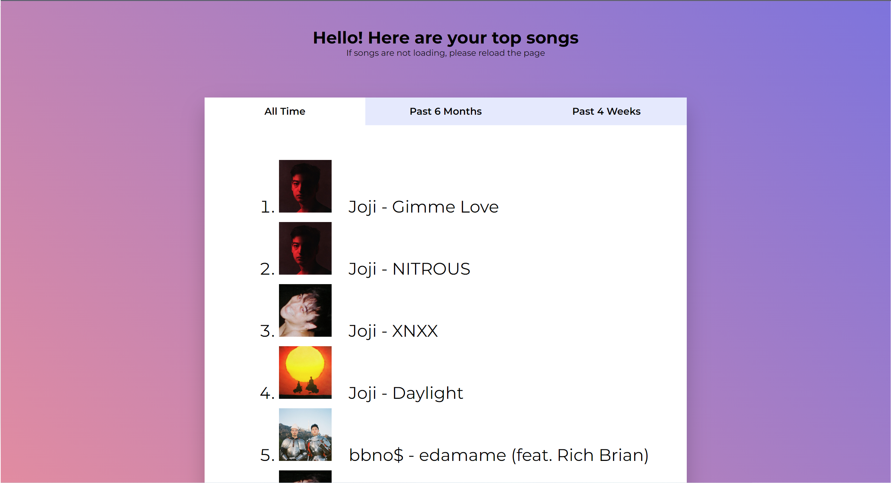
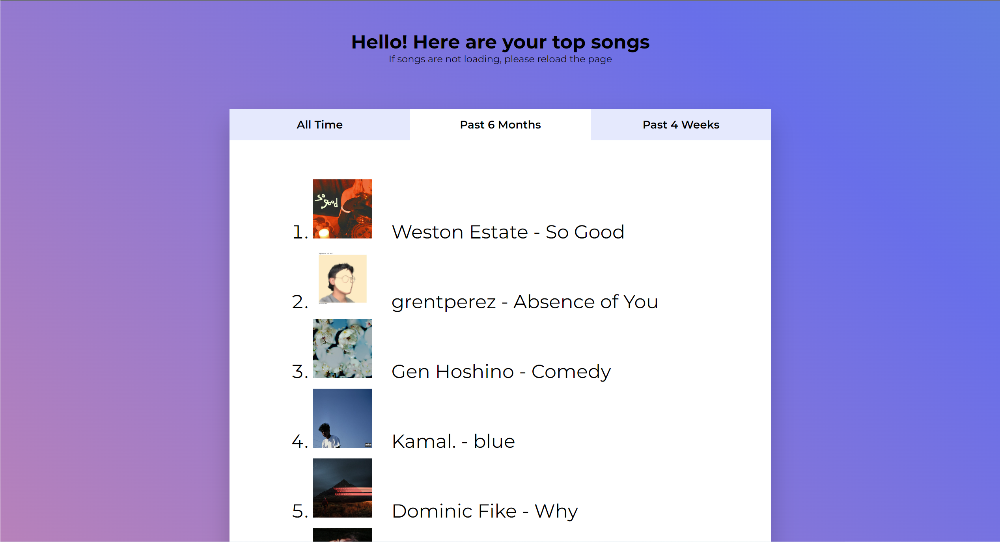

# [Discoverify](https://final-project-nicolas.pages.dev/)
Discover your most played songs in Spotify!

# Features
- Display user's top tracks from three time ranges: All Time, Past 6 Months, and Past 4 Weeks
- Website still under development. More features coming soon!

# Project Design
## Welcome Page

## Main Page

# Built With
- HTML, CSS, Javascript
- Implementation using Python and Flask can be found here: [Spotify-WebApp](https://github.com/NickAhn/Spotify-WebApp)
